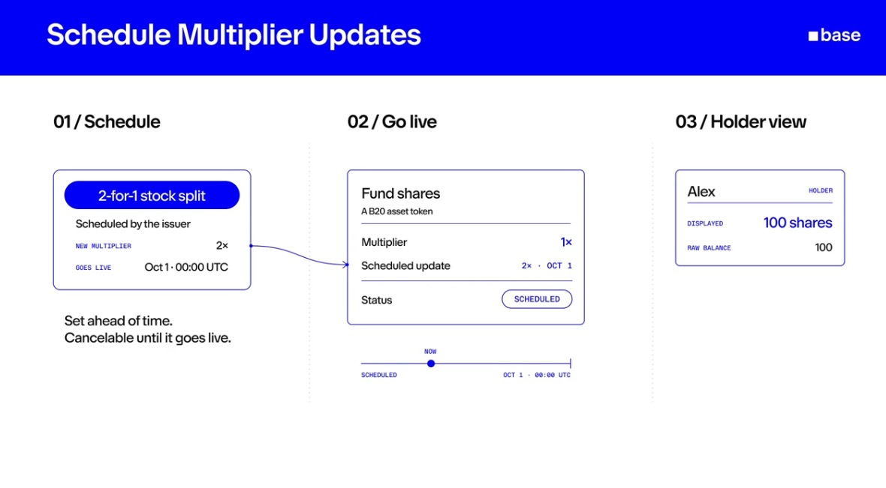
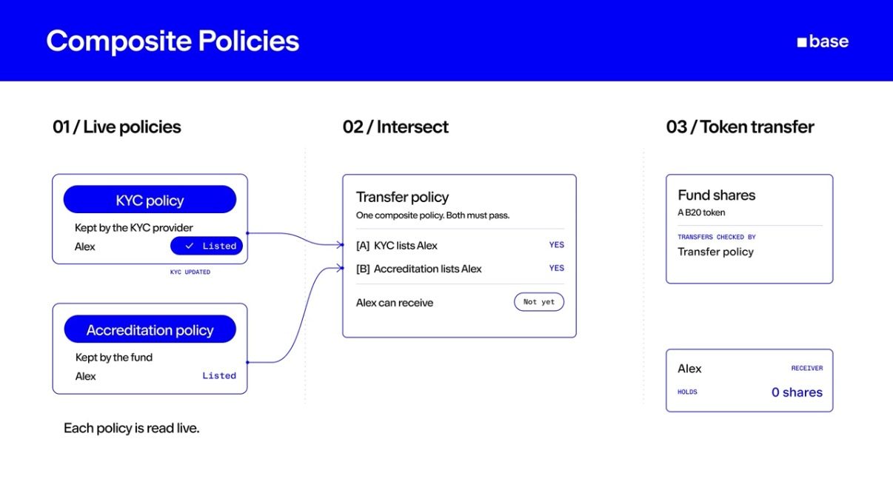
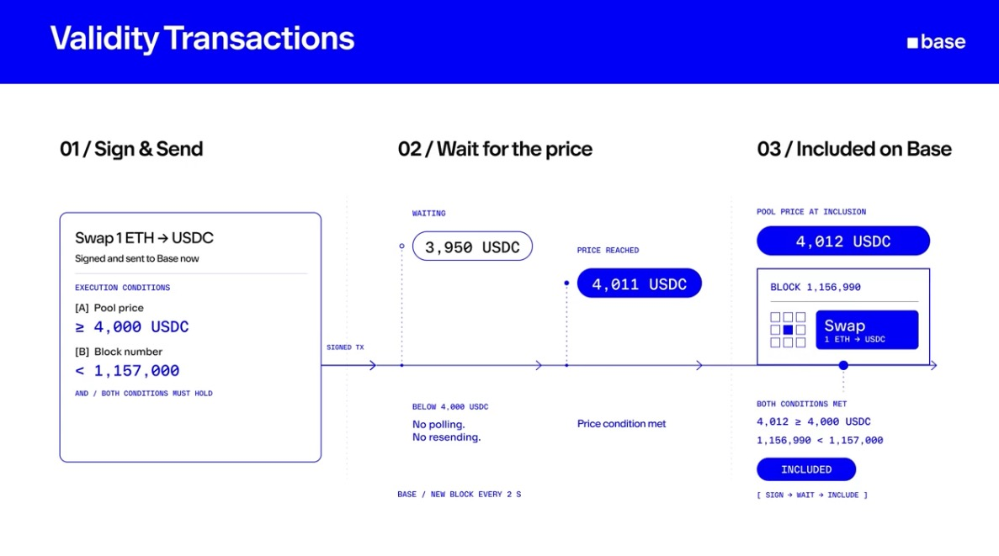

# Base style for animations

Every overlay and slide follows this, so videos from different people look like they came from one team. Source: the Base brand guide v1.0 (`base/brand-kit`) and the three reference explainers below. **Look at the references before designing any slide or diagram.** They are the target.

## References

*Three numbered steps, equal cards, one blue. Mono uppercase labels for data (`NEW MULTIPLIER`, `GOES LIVE`), a blue pill as the card's headline, a single blue connector between steps, a one-line takeaway under the first card.*

*Two inputs merging into one: stacked cards on the left, curved blue connectors into the middle card, outcomes as outlined chips (`Listed`, `YES`, `Not yet`). Note how little text each card carries.*

*A timeline across the three steps, values in blue mono (`4,000 USDC`, `1,156,990`), status as a filled pill (`INCLUDED`), and a bracketed summary line at the end (`[ SIGN → WAIT → INCLUDE ]`). The hardest concept on the page, made scannable.*

## Look

Light, flat, diagrammatic. White cards with a thin Base Blue border on a white or near-white field. One accent colour. No gradients, shadows for depth only, no effects on the Base marks.

| Role | Value |
|---|---|
| Accent (borders, pills, arrows, emphasis) | Base Blue `#0000FF` |
| Text | Gray 100 `#0A0B0D` |
| Secondary text | Gray 60 `#5B616E` |
| Card fill | White `#FFFFFF` |
| Rules and dividers | Gray 15 `#DEE1E7` |
| Field behind a slide | White `#FFFFFF` |

Never use the secondary palette (yellow, green, red, pink, tan) in overlays. Colour means one thing here: blue is "look at this".

## Type

A neutral grotesque sans for text (a Base brand typeface can replace it in `templates/theme.css` later). **Monospace, uppercase, letter-spaced** for labels and data: `NEW MULTIPLIER`, `GOES LIVE`, `2×`, `Oct 1 · 00:00 UTC`. Numbers and values are mono. Minimum 32 design px for anything a viewer must read.

## Shapes

- Cards: white, 2 px blue border, 12 px radius, generous padding.
- Headline inside a card: a blue pill with white text.
- Step numbering: `01 / Schedule`, `02 / Go live`, `03 / Holder view`. Always two digits, slash, short name.
- **Boxes in one diagram are the same size.** Flow nodes share a width and height, slide cards share a height, comparison columns share a width; the templates enforce it. A smaller box only when it is explicitly needed (a connector, a status chip), and say so in the rationale.
- Arrows: thin blue lines with a small open head, drawn in the direction of flow.
- Status chips: outlined pill, mono text (`SCHEDULED`, `YES`, `Not yet`).

## Two kinds of visual

1. **Overlays** sit on the recording: callouts, term cards, step-lists, highlights, zooms. Small, near the thing they describe, out of the caption zone and off the webcam.
2. **Slides** replace the recording for a few seconds: a blue header band with the title and the `■ base` wordmark, then up to three numbered columns, each a short heading and a card. Use a slide when the idea needs a diagram the page doesn't have (a flow, a timeline, a before/after). This is what the references show.

## Motion

Unhurried but alive. Entrances about 550 ms: fast start, long settle, a touch of overshoot (`outBack(1.2)`) so cards and nodes arrive with weight; pills pop (`outBack(1.5)`); arrows draw with `inOutQuart`. Never linear, never elastic bounce, nothing loops. Steps and nodes appear one at a time, about 0.9 s apart unless they're timed to words. Every element enters 0.25 s before the word it belongs to, so it has landed when the word is said (the renderer applies this; write the word's time).

## Words on screen

From the Base editorial style guide:
- Always **Base**. Never BASE, Base Chain, Base Network, $BASE.
- **onchain**, one word, never on-chain.
- No all caps for emphasis (mono labels are the exception), no emoji, no exclamation marks.
- No superlatives ("the best", "the first"), no financial language (yields, gains, returns).
- Technical terms are fine when the narration uses them; explain them, don't pile them up.
- Quote wording from the screen or the narration. Never invent a number.

## Marks

The Square and the Basemark appear only in a slide's header, white on Base Blue, never altered, never with effects. Nothing else in an overlay carries a logo.
