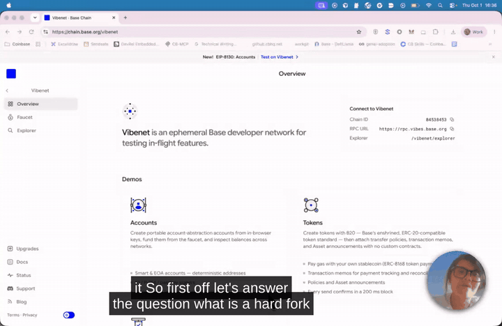
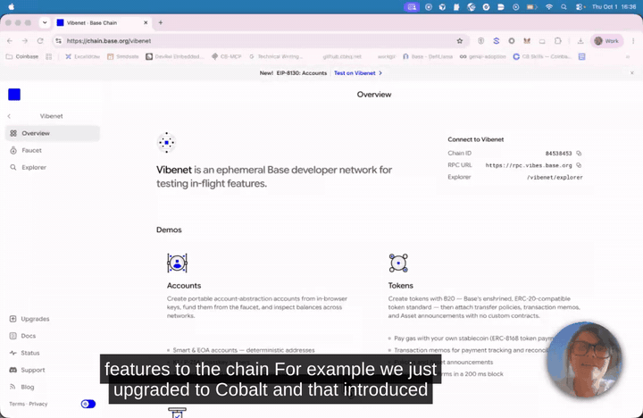
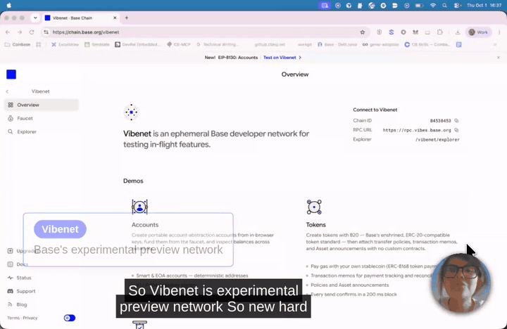
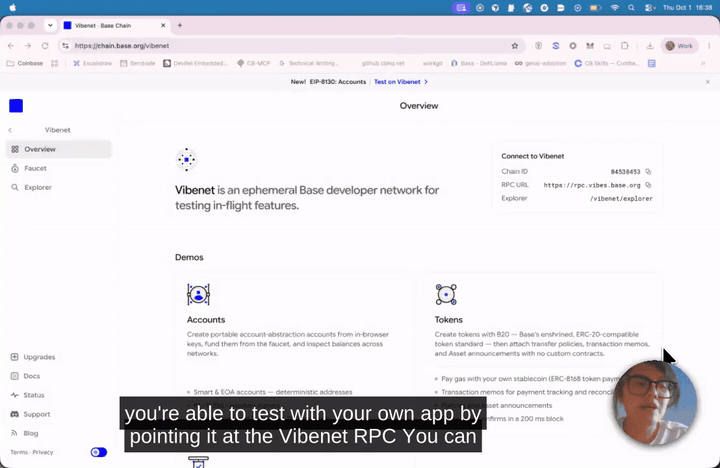
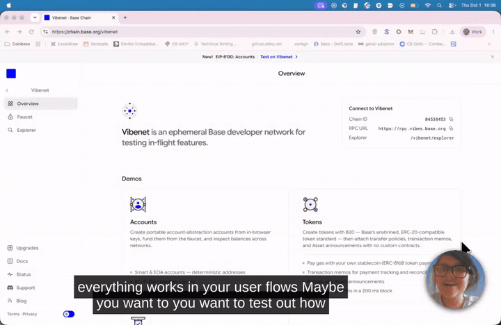
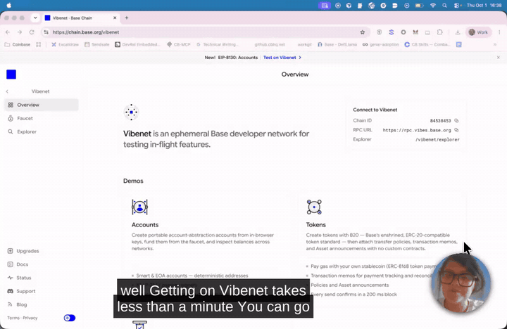
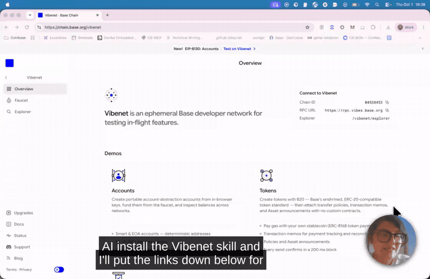
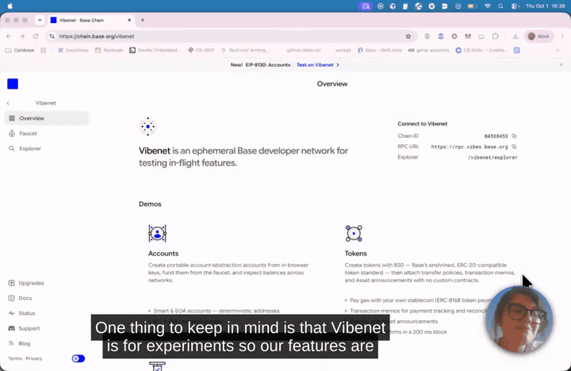
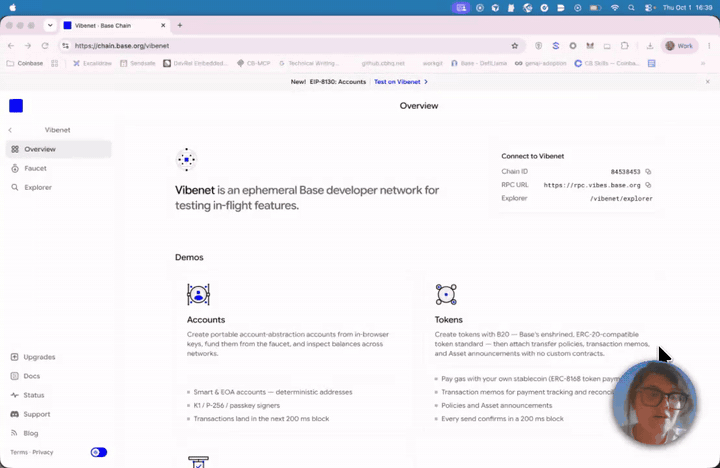
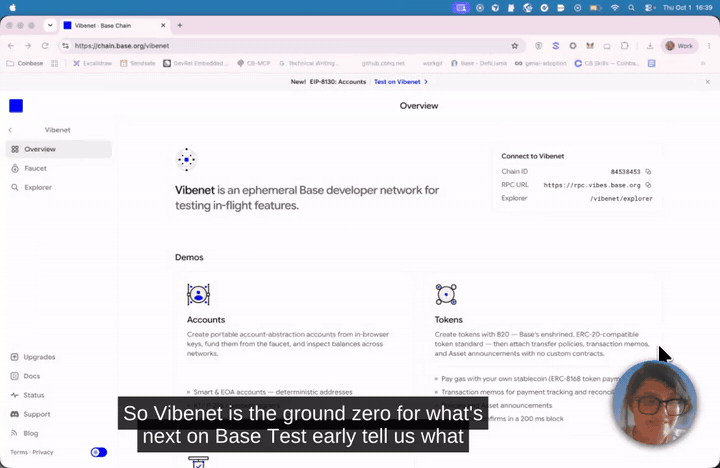

# Edit report: vibenet_demo_2.mp4

**02:57.4 → 02:56.3** (1.1s removed) · 12 visual edit(s) · 2 cut(s) · 4 candidate(s) rejected

## Learning objectives

What the agents understood this video to teach. Every edit serves one of these.

1. Know what a hard fork is and what Vibenet is: Base's experimental preview network, weeks ahead of Sepolia and Mainnet
2. Know how to test your app on Vibenet and how to get on it in under a minute
3. Know that Vibenet is experimental, that feedback still changes the features, and where to report what breaks

## Visual edits

| id | edited time | source time | template | shows | gap | objective | why |
|---|---|---|---|---|---|---|---|
| beat-1 | 00:14.1 | 00:14.1 | term-definition | **Hard fork**: Changes how the chain works, or adds new features | said-once-then-gone | 1 | She asks the question at 0:14 and answers it at 0:16–0:21; the card shows the answer in her words while she gives it. |
| beat-2 | 00:23.8 | 00:23.8 | step-list | B20 tokens → Validity transactions | said-once-then-gone | 1 | Two named features, spoken once; each lands on its word. Ends in the pause, which cut-1 then closes. |
| beat-3 | 00:50.6 | 00:51.3 | term-definition | **Vibenet**: Base's experimental preview network | said-once-then-gone | 1 | The definition, at the moment it is given. |
| beat-4 | 00:56.0 | 00:56.7 | slide |  | said-not-shown | 1 | The order she describes, never drawn. Slide in the style of reference 1; columns land on 'Sepolia' and 'Mainnet', the takeaway last. Stays through 'months prior' and the start of the Denim example, so the takeaway has time to be read (reviewer: it left too quickly). |
| beat-5 | 01:10.9 | 01:11.6 | comparison | Denim (next hard fork) vs Vibenet | relationship-not-visible | 2 | Her example is a contrast: what Denim will bring vs what Vibenet already runs. The right column lands on 'today'. |
| beat-6 | 01:24.1 | 01:24.8 | step-list | Point it at the Vibenet RPC → Deploy contracts and transactions → Check your indexers → Run your user flows | said-once-then-gone | 2 | A four-step checklist spoken quickly over a static page; each line lands on its word and the list stays up through 'user flows'. |
| beat-7 | 01:38.8 | 01:39.5 | callout | “EIP-8130 · Accounts” | shown-not-findable | 2 | The page's own banner says 'New! EIP-8130: Accounts' in 13 px; the callout ties the number she says to it. |
| beat-8 | 01:45.9 | 01:46.6 | step-list | chain.base.org/vibenet → Add the network: Chain ID 84538453, RPC → Testnet ETH from the faucet | said-not-shown | 2 | The three things to do, next to the Connect panel they refer to. Chain ID quoted from the panel (never spoken in full). |
| beat-9 | 02:04.0 | 02:04.7 | term-definition | **Vibenet skill**: For AI agents. Links below. | said-once-then-gone | 2 | Named once; the link is in the description, not on screen. Short card so it doesn't run into the next thought. |
| beat-10 | 02:12.6 | 02:13.3 | term-definition | **Experimental**: Features still in progress. The network can reset without notice. | said-once-then-gone | 3 | The caveat every tester needs, spoken once. Her wording. |
| beat-11 | 02:29.5 | 02:30.2 | step-list | Your transaction hash → What you expected → The exact error | said-once-then-gone | 3 | The feedback channel and the three things to include, spoken once and never shown. Each line lands on its word. |
| beat-12 | 02:42.8 | 02:43.5 | term-definition | **Test early. Tell us what breaks.**: Be ready for day one | said-once-then-gone | 3 | Her closing line, as the sign-off card. Same card as the first video, so the series reads as one. |

### Previews

**beat-1** · term-definition · 00:14.1

**beat-2** · step-list · 00:23.8

**beat-3** · term-definition · 00:50.6

**beat-4** · slide · 00:56.0

**beat-5** · comparison · 01:10.9

**beat-6** · step-list · 01:24.1

**beat-7** · callout · 01:38.8

**beat-8** · step-list · 01:45.9

**beat-9** · term-definition · 02:04.0

**beat-10** · term-definition · 02:12.6

**beat-11** · step-list · 02:29.5

**beat-12** · term-definition · 02:42.8

## Cuts

| id | source range | length | kind | why |
|---|---|---|---|---|
| cut-1 | 00:30.7–00:31.4 | 0.7s | dead-air | The pause after 'validity transactions' (−45 dB). beat-2 fills it; the pause ends with the animation. |
| cut-2 | 02:57.0–02:57.4 | 0.4s | dead-air | After 'Bye': reaching for the recorder. |

## Captions

✓ 36 captions burned into the video, timed to the edit. Sidecar files for YouTube and players: `captions.srt`, `captions.vtt`.

## Considered and not suggested

Ideas that were looked at and left out, with the reason.

| id | kind | idea | rejected by |
|---|---|---|---|
| cand-post-below | cue | Card 'Post what you build below' at 2:51 | Two sign-off cards in eight seconds; the first one carries the message. Suggest it back if you want the call to action on screen. |
| cand-tagline-zoom | cue | Zoom on the tagline 'Vibenet is an ephemeral Base developer network…' at 0:49 | Largest text on the page; the term card at 0:51 says it in her words instead. |
| cand-gap-cuts | cut | Cuts in the transcript gaps at 1:06.4–1:07.4, 1:56.6–1:57.7, 2:38.7–2:39.9, 2:49.9–2:51.0 | Measured: −35 (peak −15), −15, −23 and −20 dB mean. Three contain speech or loud clicks; the first peaks on a click. None is silence. |
| cand-slide-get-on | cue | Full-frame slide for 'Get on Vibenet in under a minute' | The Connect panel with the real values is on screen; a step-list beside it keeps them visible. A slide would hide the thing she is pointing at. |

## Giving notes

Reply with notes by id, for example:

- `drop cue-3`: remove an edit
- `restore cut-1`: put removed footage back
- `cue-2 is too early`: adjust timing
- `cue-4 should say "…"`: change the wording
