# Edit report: vibetnet.mp4

**02:37.5 → 02:35.2** (2.3s removed) · 12 visual edit(s) · 2 cut(s) · 8 candidate(s) rejected

## Learning objectives

What the agents understood this video to teach. Every edit serves one of these.

1. Know what Vibenet is: Base's experimental preview network, where hard fork features land first
2. Know how to test your app on Vibenet and what to look for
3. Know the demos (EIP-8130 Accounts, B20, Validity Transactions) and where to report what breaks

## Visual edits

| id | edited time | source time | template | shows | gap | objective | why |
|---|---|---|---|---|---|---|---|
| beat-1 | 00:03.2 | 00:03.8 | term-definition | **Base hard forks**: What changes for your app, and how early you can test | said-once-then-gone | 1 | The framing of the whole video, in her own words (0:10–0:18), shown as she names the topic. |
| beat-2 | 00:26.0 | 00:26.6 | term-definition | **Vibenet**: Base's experimental preview network | said-once-then-gone | 1 | The definition, quoted from the narration, at the moment it is given. |
| beat-3 | 00:31.0 | 00:31.6 | slide |  | said-not-shown | 1 | She describes the order in words over a static page. STYLE.md: an idea that needs a diagram gets a slide, in the style of reference 1 (three numbered steps, one pill, a takeaway line). Columns land on 'Sepolia' and 'Mainnet'; the takeaway lands last. Replaces the round-3 flow overlay that sat against the browser chrome. |
| beat-4 | 00:42.2 | 00:42.8 | comparison | Vibenet vs Sepolia | relationship-not-visible | 1 | Her concrete example is a contrast between two networks; the right column appears when she gets to Sepolia. Starts after the slide, which now stays long enough for its takeaway to be read. |
| beat-5 | 00:54.8 | 00:55.4 | step-list | Chain ID 84538453 → RPC rpc.vibes.base.org → Test funds: Faucet (sidebar) | said-not-shown | 2 | She says to point your app at Vibenet; the values you need are 14 px text in the Connect panel. Quoted from the screen. |
| beat-6 | 01:05.5 | 01:06.1 | step-list | Timing assumptions → RPC responses → Gaps or missing events | said-once-then-gone | 2 | A checklist spoken quickly over a static page; the list builds on each item and stays up while she finishes the thought. |
| beat-7 | 01:45.3 | 01:45.9 | callout | “EIP-8130 · Accounts” | shown-not-findable | 3 | She says the EIP number and tells viewers to click Accounts; the callout ties the two together on the card she is pointing at. |
| beat-8 | 01:52.2 | 01:52.8 | term-definition | **B20**: Base's enshrined, ERC-20-compatible token standard | said-once-then-gone | 3 | B20 is named but never defined aloud; the gloss is the Tokens card's own wording. |
| beat-9 | 01:59.6 | 02:00.2 | highlight-region |  | shown-not-findable | 3 | The button for the thing she says you can do. Short, because the page scrolls back up at 2:02 (a second before she says it). |
| beat-11 | 02:11.2 | 02:11.8 | slide |  | said-not-shown | 3 | Validity transactions are named but never explained; the page explains them in one sentence. A full-frame slide in the Base style fills the pause (STYLE.md: use a slide when the idea needs a diagram), with the bracketed takeaway from reference 3. Wording from the page: description, 'Block Bounds & Expiry', 'No Keeper Required'. Ends with the pause, so nothing hangs. |
| beat-12 | 02:20.8 | 02:21.4 | step-list | Your transaction hash → What you expected → The exact error | said-once-then-gone | 3 | The feedback channel and the three things to include are spoken once and never shown. Each line lands on its word. |
| beat-13 | 02:29.8 | 02:30.4 | term-definition | **Test early. Tell us what breaks.**: Be ready for day one | said-once-then-gone | 3 | Her closing line, as the sign-off card. |

### Previews

**beat-1** · term-definition · 00:03.2

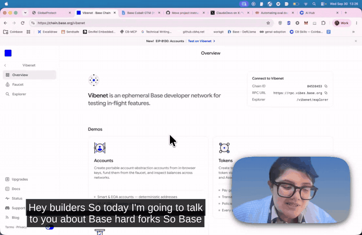

**beat-2** · term-definition · 00:26.0

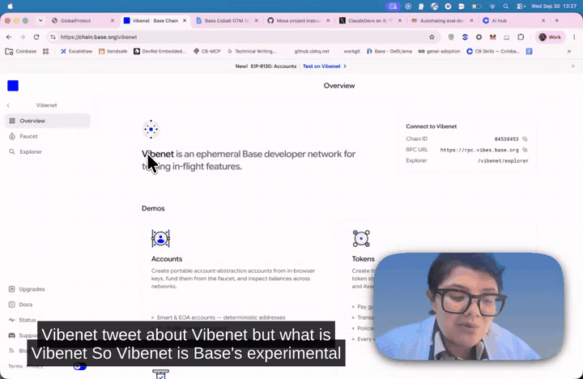

**beat-3** · slide · 00:31.0

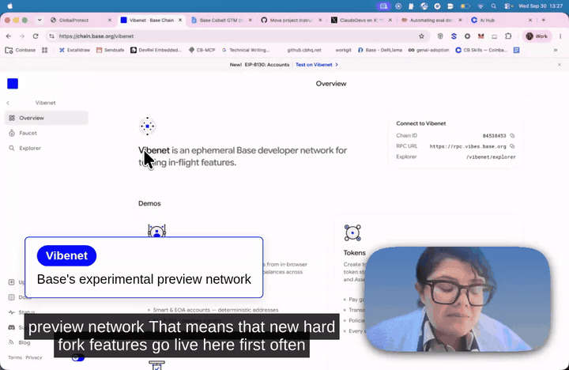

**beat-4** · comparison · 00:42.2

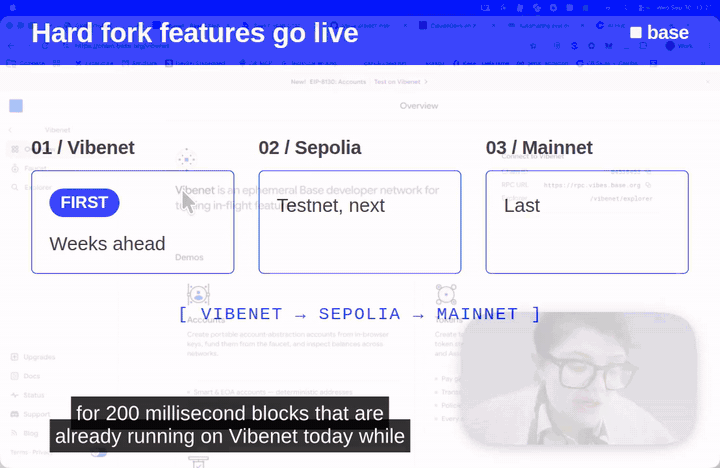

**beat-5** · step-list · 00:54.8

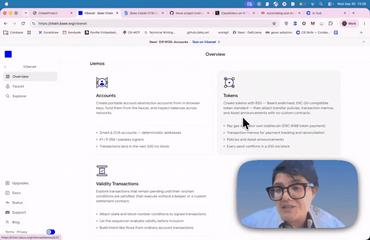

**beat-6** · step-list · 01:05.5

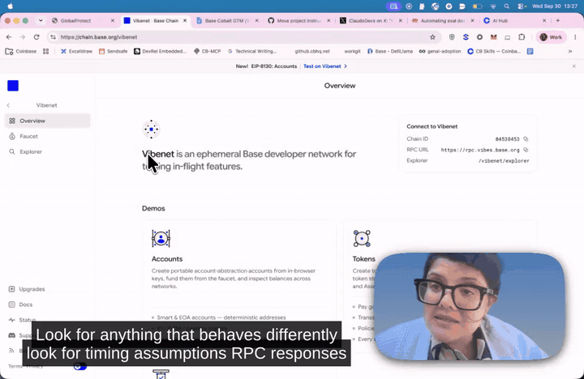

**beat-7** · callout · 01:45.3

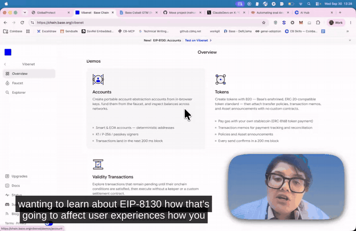

**beat-8** · term-definition · 01:52.2

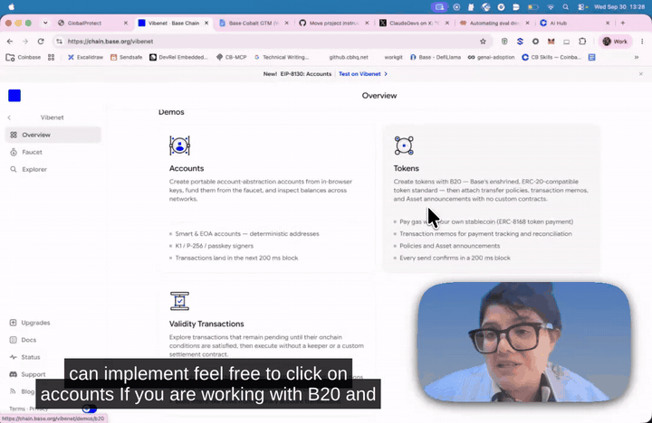

**beat-9** · highlight-region · 01:59.6

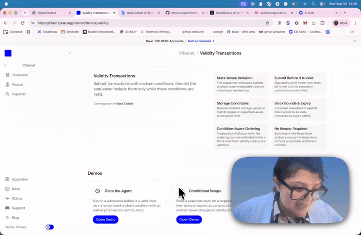

**beat-11** · slide · 02:11.2

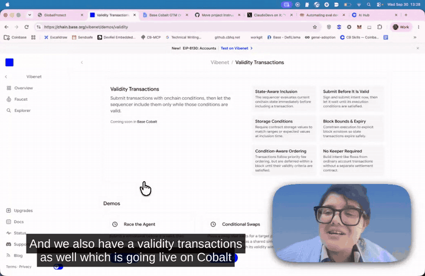

**beat-12** · step-list · 02:20.8

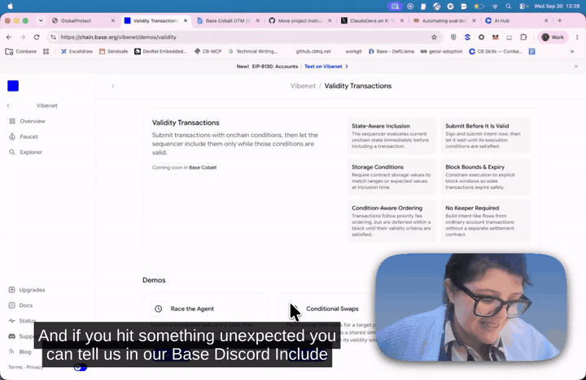

**beat-13** · term-definition · 02:29.8

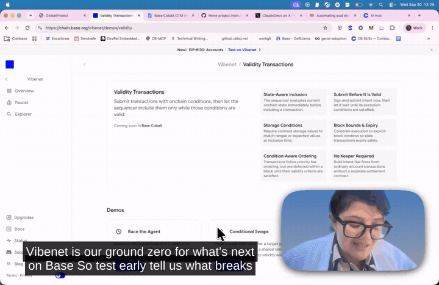

## Cuts

| id | source range | length | kind | why |
|---|---|---|---|---|
| cut-1 | 00:00.0–00:00.6 | 0.6s | dead-air | Silent lead-in; first word at 0.9. |
| cut-2 | 02:35.8–02:37.5 | 1.7s | dead-air | After 'Bye' and the wave: reaching to stop the recorder. |

## Captions

✓ 30 captions burned into the video, timed to the edit. Sidecar files for YouTube and players: `captions.srt`, `captions.vtt`.

## Considered and not suggested

Ideas that were looked at and left out, with the reason.

| id | kind | idea | rejected by |
|---|---|---|---|
| beat-3-overlay | cue | Vibenet → Sepolia → Mainnet as a flow overlay over the browser chrome (rounds 2–3) | Superseded by the beat-3 slide: STYLE.md prefers a slide when the idea needs a diagram, and the overlay was cramped against the top edge. |
| cut-pauses | cut | Round 1 cuts at 0:47.9–0:50.0 and 1:15.4–1:18.7, taken from gaps in the transcript | WRONG, reverted: both windows contain speech (−24 and −17 dB mean). The transcript had dropped the sentence 'testing on Vibenet is really easy with AI, you just need to add the skills'. The validator now measures audio inside every cut and refuses sound. |
| beat-10 | cue | Outline on 'Coming soon in Base Cobalt' at 2:11.4 (round 1) | Superseded: the Validity slide now starts on 'Cobalt' and fills the pause; two things at once would split attention. |
| cand-tagline-zoom | cue | Zoom on the tagline at 0:22 | Largest text on the page, cursor already on it. |
| cand-200ms-callout | cue | Callout '200 ms blocks' on the Accounts bullet at 1:46 (round 0 beat 4) | She talks about 200 ms blocks at 0:40, not at 1:46; moved the fact to beat-4 where it is said. |
| cand-connect-at-1-06 | cue | Connect step-list at 1:06 (round 0 guess) | She says 'point it at Vibenet' at 0:55; moved there (beat-5). |
| cand-tokens-grid-zoom | cue | Zoom on the Tokens feature grid at 2:02 | The recorder already zooms there at 1:56–2:00. |
| cand-validity-silence-cut | cut | Cut the 6.8s pause at 2:12–2:19 | beat-11 (a slide) fills it almost exactly: 5.6s in a 6.7s pause, 0.25s lead. What is left is under the 0.3s minimum cut. |

## Giving notes

Reply with notes by id, for example:

- `drop cue-3`: remove an edit
- `restore cut-1`: put removed footage back
- `cue-2 is too early`: adjust timing
- `cue-4 should say "…"`: change the wording
