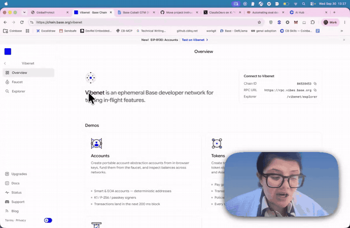
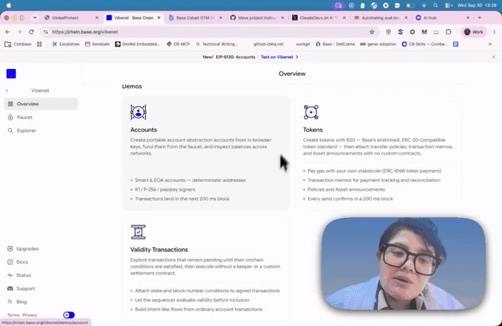
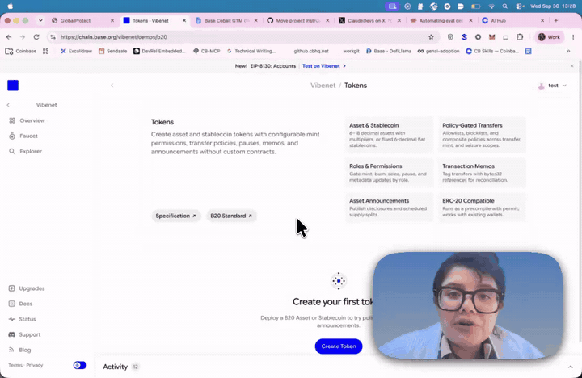
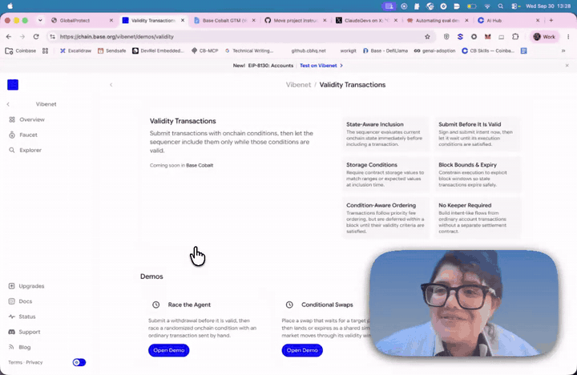

# Edit report: vibetnet.mp4

> ⚠️ **Transcript quality:** PocketSphinx fallback: expect many wrong words. Trust on-screen text (frames, OCR) over this transcript; use it mainly for timing.

**02:37.5 → 02:29.6** (7.9s removed) · 4 visual edit(s) · 5 cut(s) · 13 candidate(s) rejected

## Learning objectives

What the agents understood this video to teach. Every edit serves one of these.

1. Know what Vibenet is and how to connect to it: an ephemeral Base developer network for testing in-flight features, with Chain ID, RPC URL, Explorer and Faucet
2. Know which demos Vibenet offers and where to find them: Accounts, Tokens (B20) and Validity Transactions
3. Know that Validity Transactions are coming soon in Base Cobalt, and that viewers are invited to test and report what breaks

## Visual edits

| id | edited time | source time | template | shows | gap | objective | why |
|---|---|---|---|---|---|---|---|
| cue-1 | 01:03.2 | 01:05.6 | zoom |  | shown-not-findable | 1 | The Chain ID, RPC URL and Explorer a viewer needs to connect are ~14 design px text in the Connect to Vibenet panel, unreadable on a phone, and the screen is static here so the zoom competes with nothing. TIMING UNCERTAIN: nothing on screen marks the moment; the zoom is placed on ASR 'chains ... pc' (65.77-66.99), which may be 'chain ID ... RPC'. Region reused from the rendered preview; at 3x the webcam is cropped out for 5s. CRITIC: kept, unchanged. Simulated 3x crop (source x702-1071, y152-392) frames the whole panel with Chain ID 84538453, RPC URL https://rpc.vibes.base.org and /vibenet/explorer at ~36 design px. No recording zoom near (static 22-92s), so nothing is stacked. Uncertain for the reviewer: (1) whether the narration is about connecting at 65.8; (2) the presenter's face leaves the frame for 5s while she talks. |
| cue-2 | 01:42.4 | 01:44.8 | zoom |  | shown-not-findable | 2 | The video never opens Accounts, so this card is the only description of that demo, and its copy and bullets (~15 design px) are unreadable on a phone while the presenter's cursor rests on it (104.5-111.0, status bar /demos/account). Timing comes from the cursor hover, which is certain. The page is static 103-116. The ~2.5x zoom shows the whole card, ends before the cursor moves to Tokens (~111.3), and crops the webcam out while it lasts. CRITIC: kept, unchanged. Frames 104.5, 104.8, 107, 109, 110.7, 111: no scroll, no page change, status bar /demos/account throughout, cursor inside the card the whole time; the simulated 2.46x crop (source x231-682, y193-486) holds the full card and the cursor. The recording's own zoom starts at 116.3, 5.6s after this ends. Cost: webcam out of frame for 5.9s. |
| cue-3 | 02:00.1 | 02:02.5 | term-definition | **B20**: Base's enshrined, ERC-20-compatible token standard | said-once-then-gone | 2 | The Tokens page keeps using 'B20' (URL, 'B20 Standard' button, 'Deploy a B20 Asset') but never says what it is. The only definition was a ~15 design px line on the Overview card seconds earlier, now gone, so the viewer meets a new standard's name with nothing to attach it to. The gloss is quoted from that card. TIMING UNCERTAIN: ASR 'be twenty' at 123.28 is the only spoken anchor. The cue starts once the page settles at the top and ends before the cursor heads for Back and the recording zooms (125.6). The default bottom-left panel sits over the sidebar's lower links and empty space, clear of the buttons, the cursor and the webcam. CRITIC: kept, unchanged. Wording checked on an upscaled crop of the Overview card (107.0): 'Create tokens with B20 — Base's enshrined, ERC-20-compatible token standard —'; 'B20' is the letter B (URL /demos/b20, 'B20 Standard' button), 'ERC-20-compatible' hyphenated as quoted. The Tokens page itself never defines B20, so the gap is real. Rendered check at 124.5: panel ends just below the 'B20 Standard' button, clear of the cursor, 'Create your first token' and the webcam. Timing: it starts 0.78s before ASR 'be' (123.28), earlier than the 0.1-0.3s rule, but it cannot move later: 2.8s of reading time from 122.6 already reaches the cursor's dash to Back (125.3-125.5) and the recording's zoom (125.6). Anchored to the page settling instead. |
| cue-4 | 02:09.1 | 02:11.5 | highlight-region |  | shown-not-findable | 3 | The presenter says '...on Cobalt' (131.70-132.50) just after the recording's own zoom has ended, and at normal scale 'Coming soon in Base Cobalt' is a ~12 design px line the viewer cannot find. The outline starts 0.2s before 'on'. FLAG: the recording's zoom showed this line at 128-130.7, but only in passing while it followed the cursor to Demos; the reviewer may judge that enough. Region reused from the rendered preview; the cue starts after the zoom-out has finished (130.8). CRITIC: kept, unchanged; closest call. Frames 128, 129, 130 show the recording's zoom did make the line legible for ~2s, but before the word and while panning to Demos; 'Cobalt' itself (131.87) lands at normal scale, so the highlight is what ties the word to the label. Against it: at phone size the outlined text is still unreadable (STANDARD 7 prefers a zoom for small text, but a zoom 0.7s after the recorder's zoom-out would stack). Rendered check at 132.3: outline sits tightly on the line, covers nothing. It ends 133.5, clear of cut-4 (now 135.4). |

### Previews

**cue-1** · zoom · 01:03.2

**cue-2** · zoom · 01:42.4

**cue-3** · term-definition · 02:00.1

**cue-4** · highlight-region · 02:09.1

## Cuts

| id | source range | length | kind | why |
|---|---|---|---|---|
| cut-1 | 00:00.0–00:01.0 | 1.0s | dead-air | Silent lead-in. First word at 1.40s; silencedetect -35 dB silent 0.14-1.41 (two clicks at 0.1 and 0.5s are removed with it). Frames 0.0 and 1.0: static Overview, cursor idle; the presenter looks down at 0.0 and faces the camera by 1.0, so the edit opens on eye contact. 0.4s kept before the first word. CRITIC: kept; boundary RMS -71 dB. |
| cut-2 | 00:18.5–00:19.2 | 0.7s | dead-air | Pause between sentences, 18.17-19.51 (1.33s). Silent at -35 dB; RMS -51 to -62 dB throughout, one breath at 18.6. Static Overview, cursor idle, and the presenter looks down in both boundary frames (18.5, 19.2). Shortened to about 0.6s: 0.33s kept after 'because' and 0.30s before 'so'. FLAG: just under the ~1.5s guideline in STANDARD 6; drop it if the reviewer hears a deliberate beat. CRITIC: kept as a safe dead-air trim (0.63s of pause remains); boundary RMS -56/-58 dB; webcam head position shifts only slightly across the join. |
| cut-3 | 00:49.5–00:50.2 | 0.7s | dead-air | Pause between 'one' (48.97) and 'so' (50.77). The speech tail ends about 49.15; after that there is only breathing and silence (silent at -35 dB 49.31-50.24; not silent at -45 dB because of low breathing, RMS -42 to -56 dB), then an inhale from 50.3 into the next sentence. The screen is static (cursor parked on 'Vibenet' since 22s) and the presenter looks down in both boundary frames (49.5, 50.1). The cut removes 0.7s from the quietest part, leaving about 0.35s after the last word and 0.6s (the inhale) before the next. CRITIC: kept; boundary RMS -50/-55 dB, same pose both sides. |
| cut-4 | 02:15.1–02:19.0 | 3.8s | dead-air | Near-silent run 132.50-139.53 on the Validity page. There is no speech: the ASR 'the' tokens at 134.54 and 136.80 are 40-80 ms low-frequency bursts (mouse/trackpad clicks, some in press-release pairs), not words, and nothing on screen changes with them. CRITIC CHANGE: was 133.9-136.1 (2.2s), which kept 3.4s before the call to action only as reading time for cue-5 and made the cursor teleport across the join. cue-5 is rejected, so the cut now runs 135.4-138.95 (3.55s): it starts after the cursor has settled on Conditional Swaps (arrives by 134.9) and ends before the inhale into the call to action (139.25), so the cursor is static and the presenter is looking down in the same pose on both sides (frames 135.4, 138.9). Kept: 2.9s after 'Cobalt' (cue-4, then the cursor's move to Conditional Swaps, reading time for the page) and 0.6s before 'if' (139.53), 3.5s of the 7s in total. Boundaries: RMS -61 and -53 dB, inside silencedetect -35 dB runs 135.21-136.82 and 138.56-139.03. CHECKER CHANGE: start moved 135.4 -> 135.1 to remove a loud trackpad click (-5 dBFS) just before the join; the cursor has already settled by 134.9. |
| cut-5 | 02:35.8–02:37.5 | 1.7s | dead-air | Tail after the sign-off. The last speech ends 155.35-155.43; silencedetect -35 dB is silent from 155.37 to the end, and at -45 dB there is only faint rustle (155.7, 156.0). The wave is done by about 155.5; from 155.8 the presenter leans in, blurred, to stop the recorder. 0.37s kept after the last word. CRITIC: kept; the wave (155.0) and smile (155.5) stay in; boundary RMS -67 dB. |

## Captions

✗ **Not added.** The transcript is low-accuracy, so captions would show wrong words. Re-transcribe with Whisper and rebuild to add them.

## Rejected candidates

Ideas the agents considered and dropped, and the rule that dropped them.

| id | kind | idea | rejected by |
|---|---|---|---|
| cue-5 | cue | step-list at 02:16.5 (4.2s): 'Submit with conditions' / 'Sequencer evaluates them' / 'Included only while valid', anchored below 'Coming soon in Base Cobalt' | gap honesty + redundancy (STANDARD 1, 2, 8): the gap is labelled said-not-shown, but nothing is said (the presenter is silent 132.5-139.5) and the mechanism is shown: it is the page's own description sentence, the largest body text on the page, directly above the panel (rendered check at 140.4), so the panel restates on-screen text in a second place at the same time. The steps reveal on a 1s clock, not on words (segmenting), the last 1.2s runs into the call to action (split attention), and the mechanism is not one of the three objectives. If the sentence is too small on a phone, a zoom on it adds less (STANDARD 7) |
| cand-2 | cue | Zoom or highlight on the tagline 'Vibenet is an ephemeral Base developer network...' at 00:22 | deletion test: the tagline is the largest body text on the page (~27 design px) and the presenter's cursor already points at it for 70s; signalling is already there |
| cand-3 | cue | term-definition for 'Vibenet' or 'ephemeral' during the 00:22-01:33 static stretch | redundancy / nothing new: the tagline defines Vibenet on screen for the whole stretch; 'ephemeral' is ordinary developer vocabulary, and any gloss beyond the dictionary meaning (e.g. how often it resets) would be a fact the video doesn't contain |
| cand-6 | cue | step-list of the three demos (Accounts, Tokens, Validity Transactions) during the 01:35-01:56 tour | coherence: all three cards and their titles are on screen and hovered one by one, and there is no clear area that doesn't cover cards or the webcam. The real gap in the tour (unreadable card copy for the one demo never opened) is closed by cue-2 instead |
| cand-7 | cue | Zoom on the Tokens feature grid (~11 design px descriptions) at 02:02-02:05 | never stack: the recording auto-zoomed this grid at 116.3-119.8, and at 125.6 it zooms again; cue-3 uses this window for the undefined term instead |
| cand-11 | cut | Cut ASR repetitions ('i've i've' 27.7, 'all have all have' 89.0, 'actually actually' 144.3, 'it's it's' 149.6) as false starts | never cut what can't be confirmed: PocketSphinx output is unreliable, the audio shows continuous speech through each, and no restart is visible on screen |
| cand-12 | cue | Zoom on the Accounts bullet 'Transactions land in the next 200 ms block' at ~00:40.5 (ASR 'for a millisecond locks' 40.73-41.83, possibly '200 millisecond blocks') | deletion test: if the number is spoken, the narration already carries it and the zoom only shows the same thing; if it isn't, the zoom is unanchored. The bullet also sits in the caption band at the bottom of the page. Kept out rather than flagged because the gap itself is weak, not only the timing |
| cand-13 | cue | Zoom on the Tokens bullet 'Pay gas with your own stablecoin (ERC-8168 token payment)', hovered 113-116 | never stack: the click at ~116.2 starts the recording's own zoom at 116.3, so our zoom-out would run straight into its zoom-in; the Tokens page with its own feature grid follows immediately |
| cand-14 | cue | Highlight or term-definition for the 'New! EIP-8130: Accounts' banner | nothing new / no gap: the cursor never goes to the banner, no ASR word resembles 'EIP' or '8130', and the video says nothing about EIP-8130 beyond the banner, so a gloss would add a fact the video doesn't contain |
| cand-15 | cue | term-definition for 'Base Cobalt' at 131.9 (also possibly heard as ASR 'base conflicts' 6.70) | nothing new: the video never says what Base Cobalt is beyond 'Coming soon in Base Cobalt'; any gloss (e.g. 'upcoming Base upgrade') would be our inference. cue-4 points to the on-screen mention instead |
| cand-16 | cue | Callout showing where to report issues during the call to action ('tell us what breaks', ASR 151.60-152.62) | nothing new: the feedback channel is never shown on screen; pointing at 'Support' in the sidebar would be a guess. A text callout would also repeat unverified narration (redundancy) |
| cand-17 | cut | Shorten the 1.16s pause at 125.23-126.39 (cursor going to the browser Back button) | wait / never cut mid-transition: it is navigation, below the ~1.5s threshold, and it falls inside the recording's own zoom-in (125.6), so a cut would add a jolt to a moving frame |
| cand-18 | cut | Trim the 132.5-139.5 near-silence to ~2.5s (cut ~4.5s) | reading time (STANDARD 6), and never cut a cursor move: trimming to ~2.5s would cut into cue-4 or the cursor's move to Conditional Swaps (134.0-134.9). Critic note: the editor's reason (cue-5's reading time) fell away when cue-5 was rejected; cut-4 was re-timed to 135.4-138.95 (3.55s), keeping 3.5s of the 7s |

## Checks

- cue-4 [checker] The outlined "Coming soon in Base Cobalt" text is still too small to read on a phone; the outline shows where to look but does not make it legible. A zoom would, but the recording zoomed there 1s earlier.
- cue-1 [checker] The webcam leaves the frame for the 5s zoom (cue-2: 5.9s). Nothing is covered, but the presenter is hidden.

## Giving notes

Reply with notes by id and the agents will revise and re-render, for example:

- `drop cue-3`: remove an edit
- `restore cut-1`: put removed footage back
- `cue-2 is too early`: adjust timing
- `cue-4 should say "…"`: change the wording

Decisions are logged in `review.yaml` and feed the quality metrics (`npm run metrics`).
